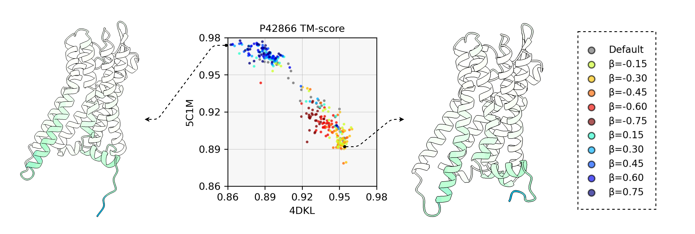
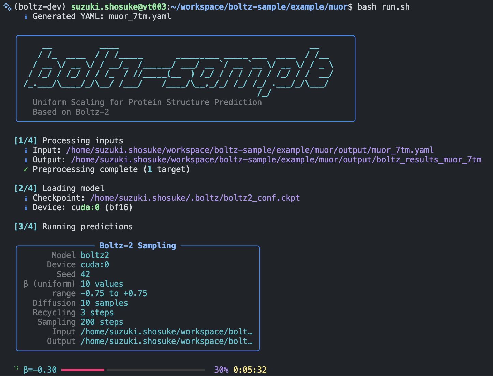
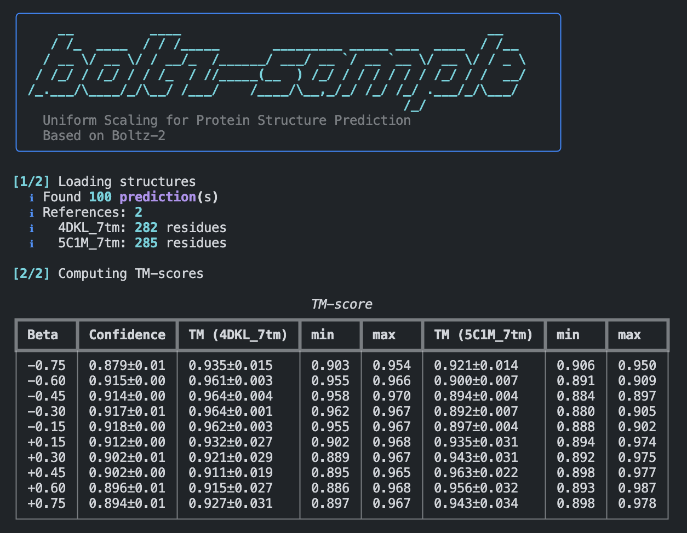

## Boltz-sample

[](https://www.python.org/)
[](https://pytorch.org/)
[](https://lightning.ai/)
[](LICENSE)

Boltz-sample extends [Boltz-2](https://github.com/jwohlwend/boltz) by uniformly scaling the latent pair representation before Pairformer refinement. See our paper: [Steering Conformational Sampling in Boltz-2 via Pair Representation Scaling](https://doi.org/10.64898/2026.01.23.701250) (bioRxiv 2026).

This introduces a scalar β that systematically modulates coevolutionary signal strength to explore alternative protein conformations, and can be easily integrated into custom Boltz or AlphaFold3 implementations (pairformer-diffusion models).



## Installation

```bash
pip install -e .

# With CUDA 12 kernel support (optional)
pip install -e ".[cu12]"
```

## Usage

This repository provides `boltz sample` for multi-beta conformational sampling.
For standard structure prediction without beta scaling, use the original [Boltz-2](https://github.com/jwohlwend/boltz).

```bash
# Multi-beta sampling (recommended for exploring conformations)
boltz sample input.yaml --out_dir output

# From FASTA + MSA
boltz sample --fasta seq.fasta --msa seq.a3m --out_dir output

# Custom beta values
boltz sample input.yaml --out_dir output \
    --scale_uniform_beta "-0.75,-0.50,-0.25,0.25,0.50,0.75"

# Single beta value
boltz sample input.yaml --out_dir output --scale_uniform_beta "0.15"

# Validate inputs without running predictions
boltz sample input.yaml --out_dir output --dry_run
```

Evaluate predictions against reference structures (TM-score via [tmtools](https://github.com/jvkersch/tmtools)):

```bash
boltz evaluate output/ --ref ref_state1.pdb --ref ref_state2.pdb
```

<table>
<tr>
<td><br><sub><b>boltz sample</b> — Multi-beta prediction with progress tracking</sub></td>
<td><br><sub><b>boltz evaluate</b> — TM-score aggregation by beta (mean±std, min, max)</sub></td>
</tr>
</table>

## Examples

```
example/
├── rfah/   # Fold-switching protein (α-helix ↔ β-barrel)
└── muor/   # μ-opioid receptor (inactive ↔ active)
```

```bash
cd example/rfah && bash run.sh
cd example/muor && bash run.sh
```

### Visualization

The example notebooks use [marimo](https://marimo.io/) for interactive visualization of TM-scores and 3D protein structures:

```bash
pip install marimo
marimo edit example/muor/visualize_tmscore.py
marimo edit example/rfah/visualize_tmscore.py
```

## Acknowledgement

This repository is based on and derived from the open-source project [jwohlwend/boltz](https://github.com/jwohlwend/boltz), which is released under the [MIT License](https://github.com/jwohlwend/boltz/blob/main/LICENSE). All original copyright notices and license terms are preserved.

If you use this code or the associated models in academic work, please cite the
following papers as requested by the original authors:

```bibtex
@article{passaro2025boltz2,
    author = {Passaro, Saro and Corso, Gabriele and Wohlwend, Jeremy and Reveiz, Mateo
    and Thaler, Stephan and Somnath, Vignesh Ram and Getz, Noah and
    Portnoi, Tally and Roy, Julien and Stark, Hannes and Kwabi-Addo, David
    and Beaini, Dominique and Jaakkola, Tommi and Barzilay, Regina},
    title = {Boltz-2: Towards Accurate and Efficient Binding Affinity Prediction},
    year = {2025},
    doi = {10.1101/2025.06.14.659707},
    journal = {bioRxiv}
}


@article{wohlwend2024boltz1,
    author = {Wohlwend, Jeremy and Corso, Gabriele and Passaro, Saro and Getz, Noah
    and Reveiz, Mateo and Leidal, Ken and Swiderski, Wojtek and Atkinson, Liam
    and Portnoi, Tally and Chinn, Itamar and Silterra, Jacob and Jaakkola, Tommi
    and Barzilay, Regina},
    title = {Boltz-1: Democratizing Biomolecular Interaction Modeling},
    year = {2024},
    doi = {10.1101/2024.11.19.624167},
    journal = {bioRxiv}
}
```

## Citation
```bibtex
@article {Suzuki2026.01.23.701250,
	author = {Suzuki, Shosuke and Amagasa, Toshiyuki},
	title = {Steering Conformational Sampling in Boltz-2 via Pair Representation Scaling},
	elocation-id = {2026.01.23.701250},
	year = {2026},
	doi = {10.64898/2026.01.23.701250},
	publisher = {Cold Spring Harbor Laboratory},
	journal = {bioRxiv}
}
```
