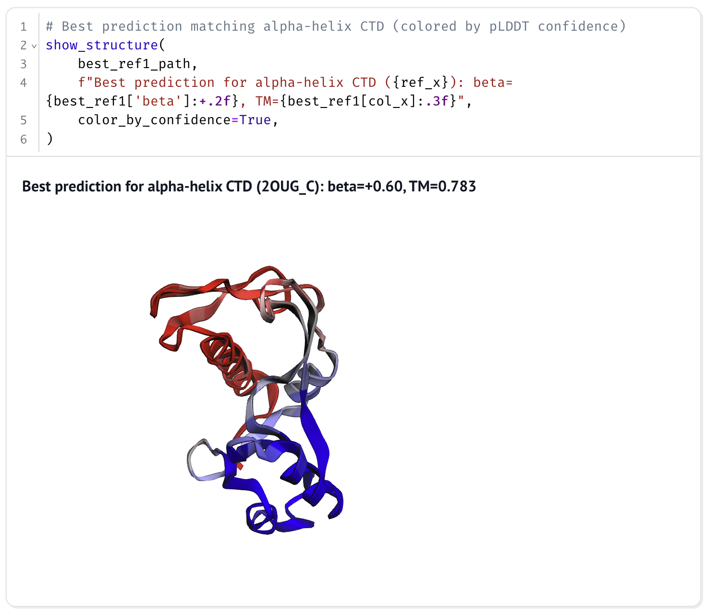
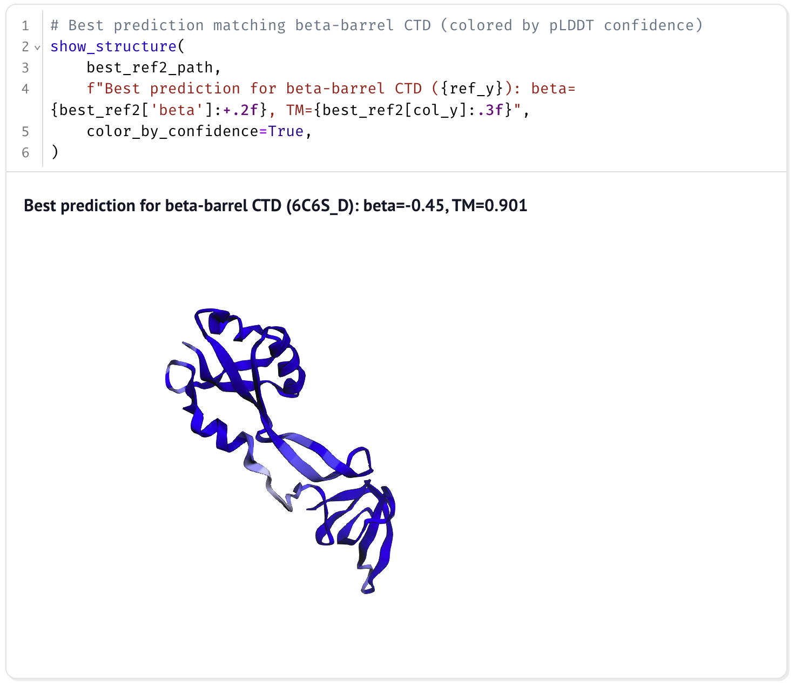
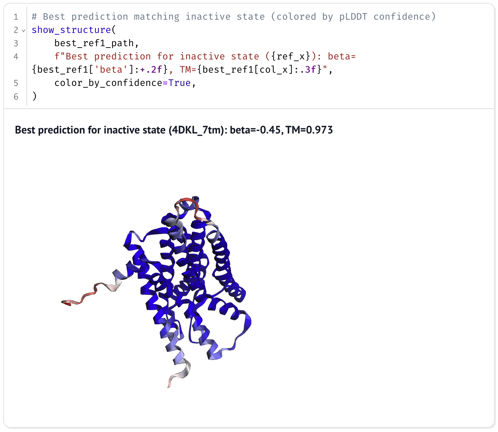
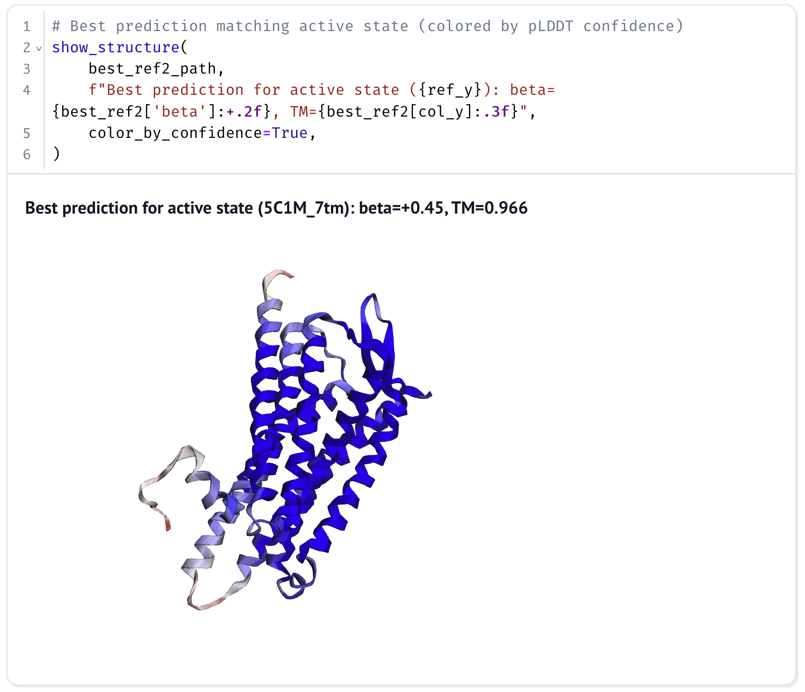

# Examples

Two protein systems with experimentally-resolved alternative conformations.
Each example ships a sequence input, reference PDBs, and `run_boltz2.sh` /
`run_af3.sh` shell scripts. The Boltz-2 inputs declare `msa: empty` and run in
single-sequence mode. The AlphaFold 3 inputs carry no MSA, so
`run_alphafold.py` builds one with its own data pipeline.

## RfaH (fold-switching protein)

The RfaH C-terminal domain switches between an α-helix fold (2OUG_C) and a
β-barrel fold (6C6S_D).

```bash
cd example/rfah
bash run_boltz2.sh       # Boltz-2 sweep, output_boltz2/
bash run_af3.sh          # AlphaFold 3 sweep, output_af3/ (needs AF3_REPO, AF3_MODEL_DIR)
```

### Visualization

```bash
pip install marimo tmtools biopython matplotlib pandas
marimo edit example/rfah/visualize_tmscore.py
```

<table>
<tr>
<td><br><sub>α-helix CTD (β=+0.60)</sub></td>
<td><br><sub>β-barrel CTD (β=-0.45)</sub></td>
</tr>
</table>

---

## μ-Opioid Receptor (GPCR)

μ-OR adopts inactive (4DKL, antagonist-bound) and active (5C1M,
agonist-bound) conformations.

```bash
cd example/muor
bash run_boltz2.sh
bash run_af3.sh
```

### Visualization

```bash
marimo edit example/muor/visualize_tmscore.py
```

<table>
<tr>
<td><br><sub>Inactive (β=-0.45)</sub></td>
<td><br><sub>Active (β=+0.45)</sub></td>
</tr>
</table>
